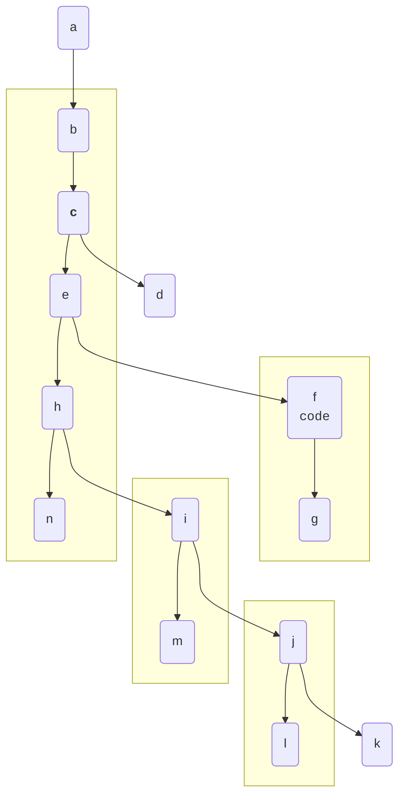

# Markdown list to mermaid
* a
    * b

    * **c**

        * d

    * e

        * f

          `code`

        * g

    * h

        * i
            * j
                * k
            * l
        * m

    * n

可以将以上 Markdown 列表转化为 Mermaid 流程图

